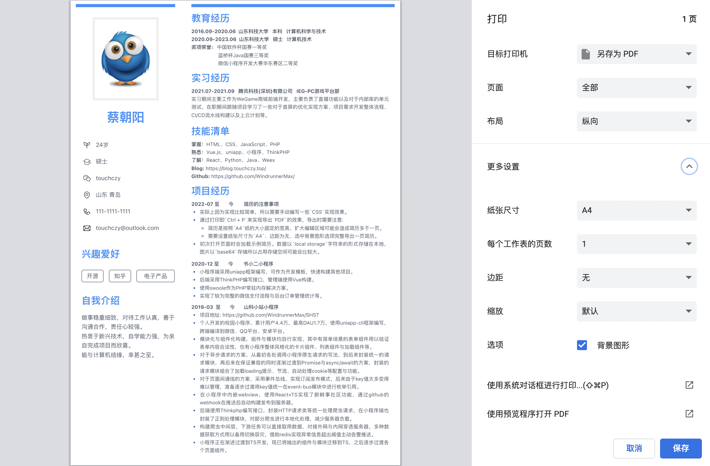

# ResumeEditor
`ResumeEditor`简历编辑器，因为各种模版用起来细节上并不是很满意，所以尝试做个简单的拖拽简历编辑器。

```bash
$ npm i -g pnpm@6.24.3
$ pnpm install
$ npx husky install && chmod 755 .husky/pre-commit
```

## 组件
* `image`: 图片组件，用以上传图片展示，图片以`base64`存储在本地。
* `text`: 富文本组件，用以编辑文字，可以参考 [Github](https://github.com/WindrunnerMax/DocEditor) ｜ [Editor DEMO](https://windrunnermax.github.io/DocEditor/)。
* `blank`: 空白组件，用以作为占位空白符，可以通过配合`CSS`实现背景效果。

## 实现

### CSS
实际上因为实现比较简单，所以需要手动编写一些`CSS`实现效果，当然也通过拓展编辑面板部分是能够解决这个问题的。

### 导出PDF
通过打印即`Ctrl + P`来实现导出`PDF`的效果，导出时需要注意: 
* 简历是按照`A4`纸的大小固定的宽高，如果扩大编辑区域可能会造成简历多于一页。
* 导出`PDF`需要设置纸张尺寸为`A4`、边距为无、选中背景图形选项才可以完整导出一页简历。


### 数据存储
初次打开页面时会加载示例简历。数据以`local storage`字符串的形式存储在本地，键值为`cld-storage`，数据存储形式为`{origin: ${data}, expire: number | number}`，通过 `JSON.parse`可以解析取出数据。由于是纯前端项目，图片数据是以`base64`的形式存储在本地，所以占用存储空间可能会比较大。
